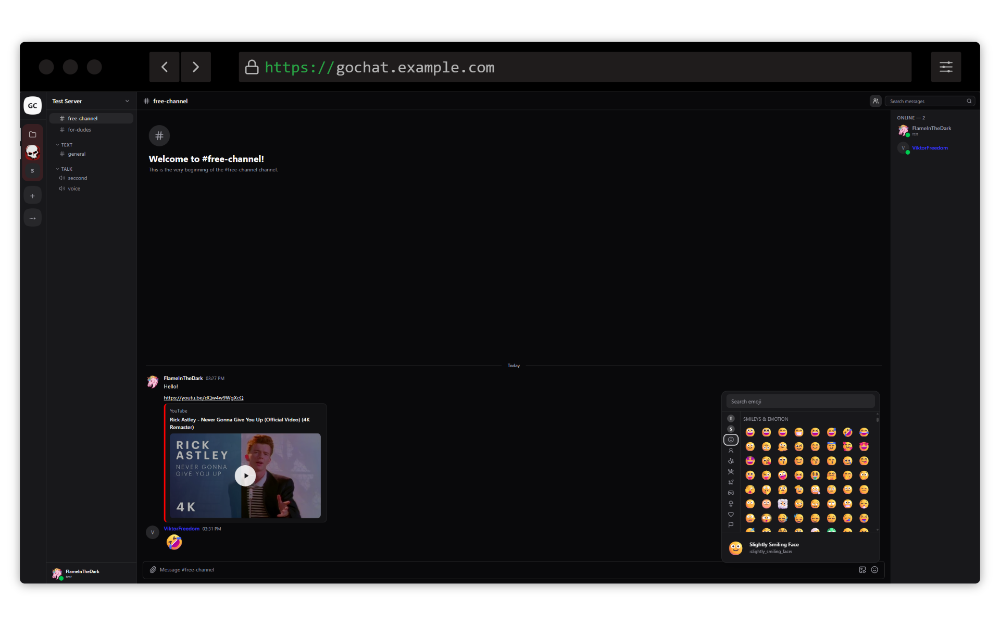

# gochat-react

A modern React chat application built with TypeScript, Tailwind CSS, and shadcn/ui.

## Screenshot



## Tech Stack

- **React 19** + **TypeScript** (strict)
- **Vite 7** - Build tool
- **Tailwind CSS v4** - Styling
- **shadcn/ui** - Component library (Zinc dark palette)
- **React Router v7** - Routing
- **TanStack Query v5** - Server state
- **Zustand v5** - Client state
- **Axios** - HTTP client with BigInt-safe JSON parsing

## Getting Started

### Prerequisites

- [Bun](https://bun.sh/) (recommended) or Node.js

### Installation

```bash
# Install dependencies
bun install

# Copy environment variables
cp .env.example .env
```

### Development

```bash
bun run dev
```

Starts the development server at http://localhost:5173

## Environment Variables

Create a `.env` file based on `.env.example`:

| Variable | Description | Default |
|----------|-------------|---------|
| `VITE_API_BASE_URL` | Full URL to the API backend | `/api/v1` |
| `VITE_WEBSOCKET_URL` | WebSocket URL for real-time | `ws://localhost/ws/subscribe` |
| `VITE_BASE_PATH` | Base path for routing (optional) | `/` |

Examples:

```env
# Local development
VITE_API_BASE_URL=http://localhost:3100/api/v1
VITE_WEBSOCKET_URL=ws://localhost:3100/ws/subscribe

# Production
VITE_API_BASE_URL=https://api.example.com/api/v1
VITE_WEBSOCKET_URL=wss://api.example.com/ws/subscribe
```

## Building

### Default Build (root path)

```bash
bun run build
```

Output is in the `dist/` directory.

### Build with Custom Base Path

To host the application on a subpath (e.g., `/chat`):

```bash
VITE_BASE_PATH=/chat bun run build
```

This will:
- Set the `<base>` tag in HTML for correct asset paths
- Configure React Router's basename

## Deployment

### Static File Hosting

The built application is fully static and can be hosted on any web server (Nginx, Apache, S3, etc.). No Node.js backend is required.

### Nginx Example

```nginx
server {
    listen 80;
    server_name example.com;

    # Serve frontend static files
    location / {
        root /var/www/html;
        index index.html;
        try_files $uri $uri/ /index.html;
    }

    # Proxy API requests to backend
    location /api {
        proxy_pass http://your-api-server:8080;
        proxy_http_version 1.1;
        proxy_set_header Host $host;
        proxy_set_header X-Real-IP $remote_addr;
    }

    # Proxy WebSocket connections
    location /ws {
        proxy_pass http://your-api-server:8080;
        proxy_http_version 1.1;
        proxy_set_header Upgrade $http_upgrade;
        proxy_set_header Connection "upgrade";
        proxy_set_header Host $host;
    }
}
```

### Subpath Deployment

To host on `/chat`:

1. Build with the base path:
   ```bash
   VITE_BASE_PATH=/chat bun run build
   ```

2. Configure your web server to serve static files at `/chat`:
   ```nginx
   location /chat {
       alias /var/www/html;
       try_files $uri $uri/ /chat/index.html;
   }

   location /chat/api {
       proxy_pass http://your-api-server:8080;
   }

   location /chat/ws {
       proxy_pass http://your-api-server:8080;
       proxy_http_version 1.1;
       proxy_set_header Upgrade $http_upgrade;
       proxy_set_header Connection "upgrade";
   }
   ```

### Docker

```dockerfile
# Build the app
FROM oven/bun:1 as builder
WORKDIR /app
COPY package.json bun.lockb ./
RUN bun install --frozen-lockfile
COPY . .
ARG VITE_API_BASE_URL
ARG VITE_WEBSOCKET_URL
RUN bun run build

# Serve with Nginx
FROM nginx:alpine
COPY --from=builder /app/dist /usr/share/nginx/html
COPY nginx.conf /etc/nginx/conf.d/default.conf
EXPOSE 80
CMD ["nginx", "-g", "daemon off;"]
```

```nginx
# nginx.conf
server {
    listen 80;
    root /usr/share/nginx/html;
    index index.html;

    location / {
        try_files $uri $uri/ /index.html;
    }

    location /api {
        proxy_pass http://api:8080;
    }

    location /ws {
        proxy_pass http://api:8080;
        proxy_http_version 1.1;
        proxy_set_header Upgrade $http_upgrade;
        proxy_set_header Connection "upgrade";
    }
}
```

```bash
# Build and run
docker build --build-arg VITE_API_BASE_URL=http://localhost:3100/api/v1 \
             --build-arg VITE_WEBSOCKET_URL=ws://localhost:3100/ws/subscribe \
             -t gochat-react .
docker run -p 80:80 gochat-react
```

## Project Structure

```
src/
├── api/              # Axios instance configuration
├── client/           # Auto-generated API client from OpenAPI
├── components/
│   ├── ui/           # shadcn components
│   ├── layout/       # App shell, sidebars
│   ├── chat/         # Message components
│   └── modals/       # Modal dialogs
├── hooks/            # Custom React hooks
├── services/         # WebSocket service
├── stores/           # Zustand state stores
├── pages/            # Route pages
└── lib/              # Utilities
```

## Commands

| Command | Description |
|---------|-------------|
| `bun run dev` | Start development server |
| `bun run build` | Build for production |
| `bun run preview` | Preview production build |
| `bun run lint` | Run ESLint |

## License

MIT
